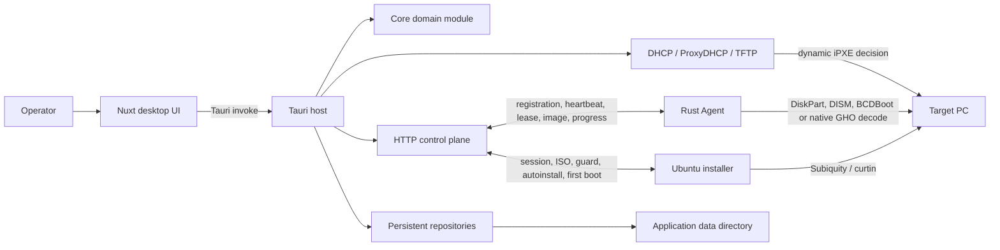
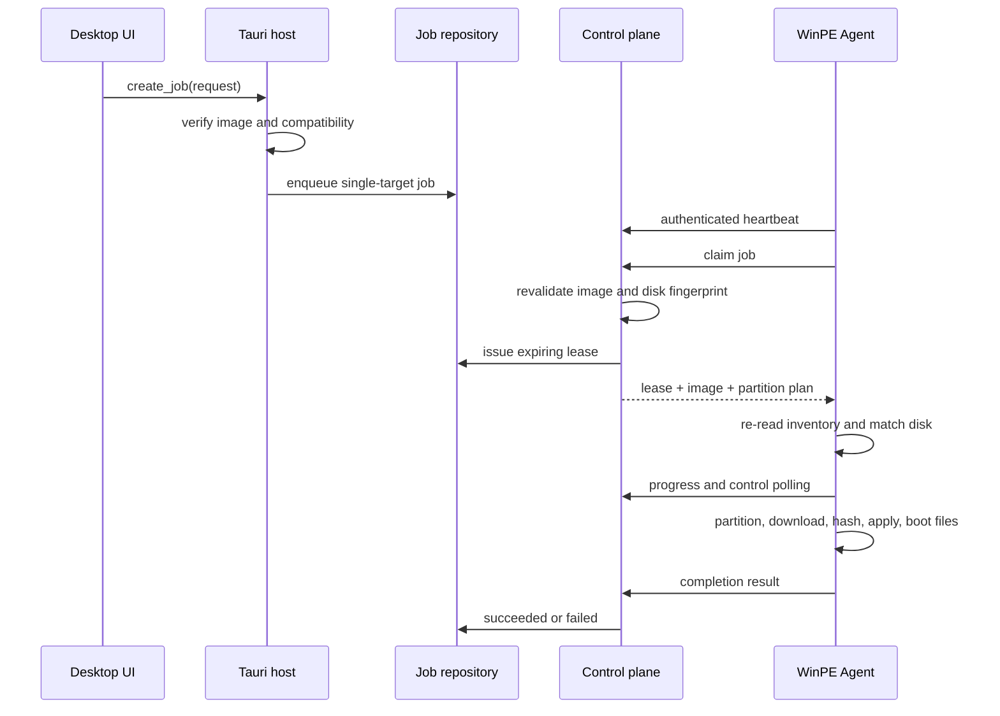

# EasyDeployMesh Design

This document explains the architecture, data flow, safety properties, and
module seams of EasyDeployMesh. It describes the current implementation rather
than a future roadmap.

## Purpose and scope

EasyDeployMesh is a local-first desktop application for discovering PCs and
coordinating repeatable Windows image deployments and a deliberately narrow
Linux installer workflow on a trusted local network.
The desktop host owns configuration, image storage, device records, job state,
PXE boot infrastructure, and the control plane. A small Agent runs on the target
machine—normally in Windows PE—and performs the destructive disk operations.

The project currently supports:

- WIM and ESD deployment through Windows DISM.
- A deliberately narrow native GHO restore profile: Ghost 11.x–12.x,
  password-free images containing one or more identifiable NTFS partition
  streams, using Z0, Z1, or Z3–Z9 compression. Single-file images and validated
  ordered GHS span sets are supported. The operator selects the source partition
  explicitly when a disk image contains multiple NTFS streams; the original
  disk layout is not restored.
- GHO, GHS, WIM, ESD, and SWM cataloging. SWM remains catalog-only.
- UEFI/GPT and legacy BIOS/MBR partition plans.
- Standalone DHCP or ProxyDHCP PXE boot with TFTP.
- Content-verified Ubuntu Server 24.04 LTS live-server ISO installation on
  amd64 UEFI targets through the distribution's native autoinstall workflow.
  Linux installation is DHCP-only, erases one uniquely identified whole disk,
  creates GPT/direct ext4 storage, and provisions one SSH-key-only user.

Capture, raw whole-disk layout restoration, encrypted GHO images, and recovery
partitions are not implemented. Linux Desktop or remastered ISOs, Legacy BIOS,
ARM, Secure Boot, static networking, RAID, LVM, ZFS, encryption, retained
partitions, raw autoinstall YAML, passwords, and arbitrary installer commands
are also outside the implemented Linux profile.

## System context



The UI is an operator console, not the source of truth. Rust modules behind the
Tauri command seam validate and persist all authoritative state. Browser-only
development mode returns safe sample or empty data and cannot perform native
operations.

## Workspace structure and dependency direction

### `crates/core`

The core module contains shared serializable domain types and pure invariants:

- Device inventory, disk fingerprints, boot modes, and architectures.
- Image formats and verified GHO or Linux-installer capability metadata.
- Deployment requests, targets, options, stages, and leases.
- Bounded Linux install intent and installer guard inventory.
- The guarded job state machine.
- Partition-plan construction and validation.

Both the host and Agent depend on these types. The module has no filesystem,
network, UI, or operating-system integration. Cross-process JSON uses
`camelCase` fields and snake-case enum values; changing either is a protocol and
persistence compatibility change.

### `crates/gho`

The GHO module is a bounds-checked, streaming decoder. Its small interface is
`inspect`, `verify`, and `decode_partition`; format parsing, compression, limits,
and corruption checks remain behind that seam. It does not invoke or ship Ghost,
Symantec, or Broadcom software.

`PARSER_VERSION` identifies the interpretation of verified metadata. If a parser
change can alter accepted bytes or expanded output, bump this version so cached
capabilities cannot silently cross implementations.

### `crates/service`

The service module contains privileged host behavior:

- `DeviceRegistry` normalizes inventory, authenticates devices, determines
  online presence, and persists `devices.json`.
- `ImageLibrary` imports images into a managed object store, discovers spans,
  validates formats, records hashes, and revalidates content for deployment.
- `JobRepository` owns job lifecycle, single-target scheduling, leases,
  progress, and `jobs.json` persistence.
- `ActivityRepository` records bounded operational history in
  `activities.json`.
- `ControlPlane` exposes the Agent HTTP protocol and composes the repositories.
- `InstallerDeployment` owns short-lived Linux installer sessions, boot
  decisions, media authorization, target-side disk guarding, generated
  autoinstall data, and first-boot completion.
- `BootPackage` imports boot media and injects the Agent runtime into WinPE.
- `PxeService` implements DHCP/ProxyDHCP, TFTP, lease persistence, and PXE client
  discovery.

These are deep modules: callers use small repository and lifecycle interfaces
while validation, locking, persistence, and protocol details remain local.

### `apps/desktop/src-tauri`

The Tauri host is the composition root and the native interface used by the UI.
At startup it opens the repositories under the platform application-data
directory, locates the bundled Agent sidecar, creates the control plane and PXE
modules, and registers Tauri commands.

`DeploymentMutationCoordinator` is an important concurrency seam. It serializes
image deletion with job creation/removal so an image cannot pass preflight and
then disappear before the job reference is persisted. Read-only operations do
not take this lock.

### `apps/desktop/app`

The frontend is a Nuxt 4 SPA using Vue, Nuxt UI, Pinia, and Nuxt i18n:

- Pages and reusable visual modules render the operator workflow.
- Pinia stores coordinate refreshes and local UI state.
- `services/` is the Tauri invocation adapter.
- `types/` mirrors the Rust wire representation.
- `utils/` contains pure selection, partition, display, and settings logic.

Do not move authoritative deployment policy into Vue or Pinia. Frontend checks
improve usability; Rust checks protect the system.

### `crates/agent`

The Agent collects hardware inventory, registers, sends heartbeats, claims one
eligible lease, executes it, reports progress, and reports completion before it
can claim another job. It uses bounded exponential backoff for registration and
heartbeat recovery.

On Windows/WinPE, the executor creates a DiskPart plan, downloads the image to a
temporary cache partition, verifies SHA-256, applies the image, creates boot
files, removes the cache partition, and reboots after confirmed success.

The Agent never executes a Linux ISO job. A previously registered device is
resolved by normalized MAC address at PXE boot, and a separate installer-session
protocol drives the Ubuntu installer. This keeps distribution-specific boot and
autoinstall behavior out of the Windows destructive executor.

### `scripts`

The scripts stage Agent sidecars, collect installers, validate WinPE packages,
collect sanitized WinPE evidence, and analyze that evidence. Diagnostic marker
strings and exit codes form a machine-readable interface and must remain stable
unless their tests and documentation change together.

## Important runtime flows

### Enrollment and presence

1. The host starts `ControlPlane` on one explicit, non-unspecified IP address.
2. A random enrollment token is returned to the desktop and written into the
   managed WinPE bootstrap.
3. The Agent presents that token once to register its normalized inventory.
4. Registration returns a device ID, a per-device token, and heartbeat interval.
5. Only the SHA-256 digest of the device token is persisted. Token comparisons
   use constant-time equality.
6. Authenticated heartbeats refresh inventory and `last_seen_at`.
7. Normal UI presence uses a 35-second window. Explicit verification uses a
   tighter 12-second window and waits for the current cycle to finish.

Re-registration by normalized MAC address preserves device identity but rotates
the device token.

### Image import and verification

1. The operator selects a GHO, WIM, ESD, SWM, or ISO file.
2. `ImageLibrary` canonicalizes the source, validates the format, discovers
   spans, and copies all files into a temporary directory in the managed store.
3. It synchronizes copied files, computes size and SHA-256, inspects GHO
capability or validates the WIM/ESD container, then atomically moves the
staged directory into `library/objects/<uuid>`.
4. The manifest records only managed paths. Symlinks, paths outside the object
   store, changed sizes, changed hashes, ambiguous spans, and unsafe names fail
   closed.
5. Job creation repeats deployment preflight while holding the mutation lock.
6. Job claim repeats image validation again before issuing a lease.
7. The Agent hashes the downloaded bytes before applying them.

For native GHO, import and preflight also decode the supported partition stream
to obtain an expanded byte count and SHA-256 for every restorable NTFS stream.
Job creation binds an explicit source partition, and the Agent checks parser
version, expanded byte count, and expanded SHA-256 while writing the locked
volume. The expanded partition must fit the planned Windows volume.

An ISO is never treated as a raw disk image. ISO import uses bounded filesystem
inspection and accepts only the implemented Ubuntu Server live-server profile.
It requires `.disk/info`, `casper/vmlinuz`, and `casper/initrd`, derives the
release and architecture from media content rather than the filename, and
copies the kernel and initrd into the same managed image object. The manifest
binds the ISO, kernel, and initrd sizes and SHA-256 values to a versioned
installer capability. Job creation and boot discovery re-open canonical managed
files and revalidate all three artifacts.

### Deployment scheduling and execution



Each persisted job currently has exactly one target. Batch deployment is a UI
operation that creates multiple independent jobs. A device may have only one
non-terminal job, preventing concurrent destructive work on the same machine.

### Linux installer session

```mermaid
sequenceDiagram
    participant PXE as iPXE target
    participant CP as Control plane
    participant Jobs as Job repository
    participant Subiquity as Ubuntu installer
    participant OS as Installed system

    PXE->>CP: boot request (MAC, amd64, UEFI)
    CP->>CP: resolve device and waiting Linux job; revalidate media
    CP-->>PXE: short-lived session + kernel/initrd/ISO/NoCloud URLs
    PXE->>CP: stream verified boot assets and ISO
    Subiquity->>CP: guard (target-computed ISO hash + observed disks)
    CP->>CP: uniquely match serial, model, and size
    CP->>Jobs: waiting -> running; bind non-reclaimable attempt
    CP-->>Subiquity: final generated autoinstall with exact /dev path
    Subiquity->>CP: bounded progress / installed callback
    OS->>CP: first-boot completion callback
    CP->>Jobs: running -> succeeded
```

The dynamic `boot.ipxe` asks the control plane for a per-device decision. A
device without a Linux assignment chains to the exact managed WinPE script; a
device with a Linux assignment that fails identity, compatibility, or integrity
checks receives a stop decision and must not fall through to another installer.
Native-ISO WinPE packages cannot host this dispatcher because their fallback
HTTP port is allocated only when PXE starts; Linux jobs therefore require a
standard managed WinPE network package.

Boot discovery creates an expiring capability session but does not yet lease the
job or authorize disk changes. The initial NoCloud `user-data` contains the
EasyDeployMesh guard in `early-commands` and deliberately omits `storage`.
The target hashes the ISO it actually downloaded, enumerates physical disks,
and posts that bounded inventory. Only an exact, unique match of the selected
non-empty serial, model, and size (with the existing 1 MiB tolerance) permits
`waiting -> running`; the response then replaces `/autoinstall.yaml` with the
host-generated whole-disk configuration. Zero or multiple matches fail before
Subiquity receives destructive storage instructions.

Installer sessions store only token digests and bind token, device, job, image,
profile version, and attempt. Media reads support a single bounded HTTP byte
range and revalidate managed paths. Installer callbacks are ordered by phase;
completion is accepted only from the installed system's one-shot first-boot
callback. Once storage authorization has been issued, the attempt is never
automatically reclaimed and pause/cancel is rejected because the host cannot
prove that Subiquity has stopped writing. A timeout is an unknown outcome that
requires operator inspection before an explicit retry.

The normal state path is:

```text
draft -> waiting -> running -> succeeded
                         |--> failed -> waiting (retry)
                         |--> paused -> running
                         `--> cancelled
```

Windows Agent jobs are leased for two hours. Progress and control polling renew
the lease. An expired running Windows lease may be claimed again, but only after
current image and disk eligibility checks pass. Linux installer attempts are
not automatically reclaimed after destructive authorization. Image download requires both device
authentication and a valid, unexpired lease for that job.

Pause and cancellation are cooperative for Windows Agent jobs. During external Windows processes,
pause suspends the process; during streaming download and hashing, the Agent
polls control state between chunks. The process runner also stops a child if the
control endpoint explicitly returns a state other than running or paused. During
a transient control-plane outage, a deliberately suspended process stays
suspended rather than resuming without operator intent.

### Disk preparation

The selected disk is represented by a fingerprint: physical-drive ID, model,
size, and optional serial number. Size comparison permits only a 1 MiB tolerance.
The control plane matches this fingerprint against current inventory before
leasing, and the Agent matches it again immediately before partitioning.

Partition plans must contain exactly one Windows partition and exactly one
Windows or data partition that consumes remaining space. GPT plans require EFI
and MSR partitions; MBR plans require a system partition. Labels, filesystems,
sizes, and data drive letters are constrained. The executor additionally rejects
unsupported recovery partitions and disks too small for Windows plus the image
cache and alignment headroom. Capacity validation is a shared Core invariant
used by the desktop host before job creation and by the Agent before it builds
the destructive DiskPart script. It uses the target's reported byte capacity,
all fixed partitions (including GPT/MBR boot partitions), the rounded-up image
size plus 512 MiB cache headroom, 32 MiB alignment headroom, and at least 1 GiB
for a remaining data partition or 20 GiB for a remaining Windows partition.
The frontend mirrors this calculation only to identify every undersized batch
target early; Rust remains authoritative. The custom-template editor derives
its fixed-partition limits and remaining-space preview from the same inputs, so
decimal manufacturer capacity is not presented as fully allocatable GiB.

The image is first stored on a temporary NTFS cache partition. After successful
application and boot configuration, that partition is deleted and the intended
remaining-space partition is extended. An MBR layout that would otherwise need
more than four primary partitions keeps the System Reserved and Windows
partitions primary, then places all data volumes and the temporary cache in one
extended partition as logical volumes. Data partitions must be last in such a
plan so the extended container cannot consume space needed by a later primary
partition.

### PXE and WinPE

Boot media import supports an existing directory or ISO/IMG media. ISO import
uses a validated, read-only UDF view when the image advertises UDF, with ISO 9660
as the fallback for media without UDF. A malformed or unsupported advertised
UDF filesystem fails with a compatibility error instead of being mistaken for
ISO media without a WinPE WIM. Import occurs in a temporary directory and
replaces the managed boot tree only after the new package is complete. Standard
media uses bundled iPXE chainloaders for both BIOS and UEFI x64; both paths then
load the same `boot.ipxe`, wimboot, generated BCD, WIM, and SDI. Standard media,
including EasyU 3.6, supplies its source `bootmgr` because some customized WIMs
do not embed `bootmgr.exe`. USM v5F uses generation-specific renamed Boot
Managers; import accepts one only when the BCD-selected WIM has a recognized
USM generation, the matching `BOOT/USM6MGR` or `BOOT/USM8MGR` exists, and the
bounded candidate contains Windows Boot Manager identity markers. A standard
named `bootmgr` always takes precedence, and unmatched or malformed aliases
fail closed. Because the accepted USM Boot Manager loads `\Boot\SC6`, its
persisted media policy maps the same generated managed BCD to both virtual
names `BCD` and `SC6`; refresh preserves that mapping and never restores the
vendor BCD. That USM-only BCD policy also preserves the source store's
`nointegritychecks` and `testsigning` compatibility flags; all standard media
continue to use a BCD without either override. Edgeless Beta 4.1.0 is identified from its required
external resource layout and instead lets wimboot select the matching BIOS or
UEFI Boot Manager embedded in the WIM; its vendor-patched source `bootmgr`
requires a nonstandard `\Boot\BCF` store. This per-media policy is persisted in
the managed package and retained when network loaders are refreshed. Vendor EFI
executables and vendor-specific BCD references are not retained in either
normalized boot chain. The managed BCD is regenerated and
validated before each PXE service start; the layout marker records the package
revision but is not trusted as a substitute for validating current BCD content.
The iPXE script supplies each flat initrd name through both
the UEFI `--name` option and the Legacy BIOS positional argument, so wimboot
receives a valid CPIO archive and cannot select a vendor BCD in place of the
managed store. The managed store is served from the distinct source path
`boot/easydeploymesh.bcd` and mapped to the flat virtual name `BCD`; this avoids
reusing a stale or vendor-provided `boot/BCD` file while preserving the path
expected by Windows Boot Manager.

Some third-party WinPE media, including Edgeless Beta 4.1.0, keeps required
runtime resources beside `boot.wim` instead of inside it. When import detects
the Edgeless root marker and required component archive, it copies that bounded,
already-extracted resource tree into `X:\Edgeless` while the managed WIM is
mounted. This preserves the vendor initialization contract in PXE boots, where
no removable-media drive exists, while leaving the source ISO unchanged.

WEPE64 v2.2 is rejected during import. Its private `WEPE/WEPE64` boot chain can
be made PXE-bootable, but the vendor runtime omits the Windows network module,
including TCP/IP and DHCP payloads required after iPXE transfers control to
Windows. Agent or NIC-driver injection cannot repair that missing platform
capability, so accepting the image would create a boot package that cannot
perform automated deployment. The UI rejects recognizable WePE filenames
before native import, while the service independently detects and rejects the
private layout so renaming the media cannot bypass the restriction. EasyU 3.6
is the currently validated third-party PE runtime; other network-enabled WinPE
media must be validated before use. The Windows Agent uses `GetAdaptersAddresses` as
a bounded fallback when a compatible reduced WinPE still provides networking.
Paths supplied to TFTP must be safe relative paths.

Standalone DHCP refuses to start if another DHCP server responds. ProxyDHCP
uses the existing network DHCP service while providing boot information.
`PxeService` binds only the configured IPv4 interface, persists DHCP leases, and
tracks clients through discovery, download, and Agent-waiting stages.

macOS reserves the DHCP and TFTP UDP ports below 1024. When PXE starts, the
desktop therefore launches its own executable in a narrowly scoped helper mode
through the system administrator authorization dialog. The helper can only bind
UDP 67, 68, and 69 on the selected IPv4 address; it passes those three file
descriptors back over a private, owner-only Unix socket and immediately exits.
All DHCP conflict detection, lease handling, packet processing, TFTP file access,
and application state remain in the unprivileged desktop process. Windows keeps
its existing direct socket path.

The Agent binary, bootstrap, startup scripts, and diagnostics collector are
injected into `boot.wim`. SHA-256 marker files plus a runtime-layout revision
avoid unnecessary mounts while ensuring an upgraded Agent or injection layout
refreshes an existing package.

Windows keeps the native DISM, BCDEdit, and registry-tool import path. On macOS,
the desktop verifies and invokes its pinned, architecture-specific
`wimlib-imagex` sidecar and uses `crates/bcd` to generate a fresh canonical BCD
store and, only when the startup-file route is unavailable, to update the
bounded `SYSTEM\\Setup\\CmdLine` value. The imported media's BCD is never trusted
or edited in place. WIM changes and all injected resources are verified in a
staging copy before atomic boot-package replacement, so a failed macOS import or
bootstrap refresh leaves the current package authoritative. A read-only runtime
capability command exposes the selected backend to the UI; the service repeats
the capability check before mutation.

## Persistence model

All durable state lives below Tauri's platform application-data directory:

```text
<app-data>/
├── activities.json
├── devices/devices.json
├── jobs/jobs.json
├── library/images.json
├── library/objects/<uuid>/...
├── pxe-config.json
├── pxe-leases.json
└── pxe-boot/...
```

Repository manifests carry a schema version. Most mutations clone in-memory
state, validate and persist the proposed state, then replace the in-memory copy.
Activity and PXE configuration writes use temporary-file replacement. Image and
boot-package imports use staged directories so incomplete copies do not become
authoritative.

Activity history retains at most 10,000 events and 30 days. Device, image, and
job manifests currently have no automatic retention policy.

## Trust and security model

EasyDeployMesh assumes the operator controls the desktop host and that the
deployment network is trusted and isolated. The current control channel is HTTP;
there is no confidentiality, server authentication, TLS, or certificate pinning.
Do not expose it to an untrusted LAN or the public internet.

The application still applies defense in depth within that trust model:

- Explicit bind-interface selection.
- Ephemeral enrollment credentials and per-device bearer credentials.
- Digested secrets and constant-time comparisons.
- Authenticated, device-bound, expiring job leases.
- Digested, expiring installer-session capabilities bound to one device, job,
  image, profile version, and attempt.
- Managed image paths with canonicalization and symlink rejection.
- Repeated compressed-image and expanded-GHO integrity verification.
- Repeated ISO, kernel, and initrd verification, including an ISO hash computed
  by the target before destructive autoinstall storage is released.
- Repeated target-disk fingerprint verification.
- Guarded job transitions and one active job per device.
- Bounds and expansion limits in the GHO parser.
- Locked and dismounted target volume for native GHO writes.
- Sanitized diagnostic tooling that does not echo enrollment tokens.

Security-sensitive failures should remain fail-closed. A connectivity or parsing
problem is not a reason to bypass authentication, verification, or targeting.

## Module seams and design rules

- Keep shared domain invariants in `crates/core`, not duplicated in TypeScript,
  the control plane, and the Agent.
- Keep format parsing and decompression behind `crates/gho`'s streaming
  interface. Callers should not understand GHO record structure.
- Keep persistent collection invariants inside the repository modules. Callers
  should ask for a domain operation rather than mutate manifest-shaped data.
- Keep transport composition in `ControlPlane`; do not let HTTP request details
  leak into repositories.
- Keep distribution boot syntax and generated autoinstall data inside
  `InstallerDeployment`; callers provide bounded intent, never raw YAML or
  arbitrary early/late commands.
- Keep native command invocation and destructive execution in the Agent. The
  Ubuntu path delegates installation to Subiquity only after the independent
  target guard succeeds. The desktop host approves bounded work; it does not
  remotely accept or construct arbitrary operator shell commands.
- Keep Tauri commands thin but policy-aware. Cross-repository atomicity belongs
  in a coordinator such as `DeploymentMutationCoordinator`.
- Keep frontend utilities pure when possible and test them through their exported
  interface. Browser fallbacks must never simulate successful native mutations.
- Introduce a new seam only when behavior genuinely varies, usually with both a
  production adapter and a test adapter. Avoid pass-through modules that merely
  duplicate another interface.

## Testing strategy

- `crates/core`: pure state-machine, fingerprint, and partition invariants.
- `crates/bcd`: bounded, platform-independent REGF parsing and the narrow BCD
  and SYSTEM Hive operations needed to construct WinPE boot packages.
- `crates/gho`: decoder behavior, truncation, corruption, compression, and
  expansion limits.
- `crates/service`: repository persistence, validation, authentication, HTTP
  protocol behavior, installer-session phase ordering, media/disk guards, PXE
  packet handling, and boot-package logic.
- `crates/agent`: inventory parsing, retry behavior, diagnostics, layout
  generation, and pre-destructive disk checks.
- `apps/desktop/src-tauri`: cross-repository coordination and compatibility
  policy.
- `apps/desktop/tests`: pure frontend behavior and navigation contracts.
- `scripts/*.test.mjs`: diagnostic report structure, sanitization, and exit-code
  contracts.

Windows, WinPE, PXE, DISM, DiskPart, BCDBoot, and native volume writes also need
manual validation in a disposable machine or virtual machine. Unit tests are not
evidence that a destructive workflow works on real firmware and storage.

## Build and release shape

The repository uses pnpm for JavaScript orchestration and Cargo for the Rust
workspace. Every desktop bundle carries the same statically linked Windows x64
Agent as a resource because that executable is injected into WinPE; it does not
run as a host-platform sidecar. The desktop host itself is built for macOS Intel
and Apple Silicon, Windows ARM64, x86, and x64, and Linux ARM64 and x64.
`pnpm build:mac`, `pnpm build:windows`, and `pnpm build:linux` build each platform's
architecture set and collect architecture-labelled installers in `release/`.
Non-Windows hosts use `cargo-xwin` for Windows cross-builds.

The workspace version is repeated in the root package, desktop package, Tauri
configuration, and browser fallback state. A release must keep those values in
sync and update `CHANGELOG.md`.
