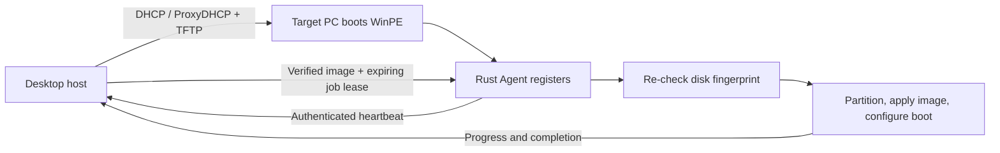

<div align="center">
  

  <h1>EasyDeployMesh</h1>

  <p>
    Discover PCs and orchestrate safe, repeatable Windows image deployments<br>
    from one desktop application on your local network.
  </p>

  <p>
    <a href="#features">Features</a> ·
    <a href="#quick-start">Quick start</a> ·
    <a href="#supported-images">Image support</a> ·
    <a href="#security-model">Security</a> ·
    <a href="DESIGN.md">Design</a> ·
    <a href="CONTRIBUTING.md">Contributing</a> ·
    <a href="CHANGELOG.md">Changelog</a>
  </p>

  <p>
    <a href="LICENSE"></a>
    <a href="https://github.com/Bald-M/EasyDeployMesh/releases/latest"></a>
    <a href="#project-status"></a>
  </p>
  <p>
    
    
  </p>
  <p>
    <a href="README.zh-CN.md"><code>中文</code></a>
  </p>
</div>

> [!WARNING]
> EasyDeployMesh performs destructive disk operations. Test deployments on a
> disposable machine or virtual machine first. The current HTTP control channel
> is intended only for trusted, isolated LANs until TLS and certificate pinning
> are implemented.

## See it in action

<p align="center">
  
</p>

## Why EasyDeployMesh?

EasyDeployMesh brings device discovery, PXE boot, image verification, deployment
jobs, and WinPE execution into a single local-first workflow. The desktop host
keeps authoritative state and approves work; a small Rust Agent running on the
target machine performs the deployment.

The project is designed to fail closed. Images are copied into a managed store
and verified before use, jobs are issued through authenticated expiring leases,
and the target disk fingerprint is checked again immediately before
partitioning.

## Features

- Cross-platform desktop host built with Nuxt 4, Nuxt UI, and Tauri 2.
- Simplified Chinese and English interface with runtime language switching.
- Local-network device registration, hardware inventory, authenticated
  heartbeats, and online-presence tracking.
- Standalone DHCP or ProxyDHCP PXE service with TFTP and client discovery.
- ISO, IMG, and existing boot-directory import; compatible network-enabled
  WinPE layouts receive automatic Agent injection into a managed `boot.wim`.
- Persistent WIM, ESD, and SWM image catalog with SHA-256 verification.
- Unattended WIM/ESD deployment using DiskPart, DISM, and BCDBoot in WinPE.
- Guarded deployment state machine with pause, retry, cancellation, progress,
  activity history, and durable job storage.
- Machine-readable WinPE diagnostics with token redaction and integrity checks.

## How it works



For the module layout, protocol flow, persistence model, and safety invariants,
see [DESIGN.md](DESIGN.md).

## Supported images

### PE media compatibility

| PE media | PXE boot | Agent registration | Automated deployment | Status |
| --- | :---: | :---: | :---: | --- |
| EasyU 3.6 | Yes | Yes | Yes | Currently verified |
| Edgeless Beta 4.1.0 | Yes | Yes | Yes | Complete PXE and automated deployment flow verified with Legacy BIOS and UEFI x64 |
| Standard network-enabled WinPE | Expected | Expected | Expected | Depends on the Windows build and NIC drivers; validate before use |
| WePE 2.2 | Native ISO boot only | No | No | Unsupported: the vendor intentionally omits the Windows network module |

EasyU 3.6 and Edgeless Beta 4.1.0 are currently verified for the complete
automated deployment flow. Edgeless has passed managed PXE boot, Agent
registration, and automated deployment in both Legacy BIOS and UEFI x64 modes;
its external runtime resources are embedded in the managed WIM. WePE 2.2 can
reach its desktop through the native ISO boot path, but it has no supported
network module, so the EasyDeployMesh Agent cannot register or download
deployment images. Changing the VMware adapter or injecting only a NIC driver
does not restore the missing TCP/IP and DHCP stack. EasyDeployMesh does not
modify the user-selected source ISO; unsupported offline PE media must not be
used for automated deployment.

| Format | Catalog | Deploy | Notes |
| --- | :---: | :---: | --- |
| WIM | Yes | Yes | Verified on import and again before deployment |
| ESD | Yes | Yes | Uses the WIM deployment operation and a selected image index |
| SWM | Yes | No | Catalog-only in the current Agent |
| GHO | No | No | Unsupported; convert the image to WIM or ESD before import |
| GHS | No | No | Unsupported Ghost span format |

### Why GHO is unsupported

EasyDeployMesh does not support importing, validating, or restoring Norton
Ghost GHO/GHS images. The format is proprietary, has incompatible variants and
compression layouts in real-world images, and no longer has a maintained
official recovery engine that this project can safely redistribute or depend
on. A parser accepting the file header is not sufficient evidence that a
destructive restore will reproduce the original partition correctly, so the
project fails closed instead of offering partial or experimental support.

Existing GHO/GHS images must first be restored or converted in an isolated,
disposable environment using software that the operator is licensed to use.
Capture the resulting Windows partition as WIM or ESD, verify it, and import
that supported image into EasyDeployMesh. Never test a conversion or legacy
Ghost restore against the developer workstation or a disk containing valuable
data.

## Quick start

### Install a release

Download the latest installer from
[GitHub Releases](https://github.com/Bald-M/EasyDeployMesh/releases/latest).

1. Open **Settings** and select the network interface connected to your isolated
   deployment LAN.
2. Start the control service.
3. Import WinPE media and start PXE, or launch the Agent manually on a target.
4. Confirm that the target appears online under **Devices**.
5. Import a supported image, select the exact target disk, and create a
   deployment job.

For a manual Agent diagnostic run:

```powershell
easydeploymesh-agent.exe --server http://192.168.1.10:7760 `
  --enrollment-token easydeploymesh_enroll_... --once
```

The enrollment token is ephemeral. Do not paste real tokens into issues, logs,
screenshots, or documentation.

### Run from source

Requirements:

- Node.js 22+
- pnpm 11+
- Rust 1.96+
- Tauri 2 platform prerequisites

```bash
pnpm install
pnpm dev
pnpm tauri:dev
```

`pnpm dev` runs the UI in a browser with safe native-command fallbacks.
Use `pnpm tauri:dev` when testing host integration.

## Development

Run the complete validation suite:

```bash
pnpm check
```

Build the desktop application:

```bash
pnpm build
```

With no arguments, this builds every native installer for the current host plus
the Windows installers that can be cross-compiled with `cargo-xwin`. You can
also select a whole platform, one architecture, or several targets:

```bash
pnpm build -- windows
pnpm build -- windows-x64
pnpm build -- macos-x64 windows-x64
```

The existing platform aggregate commands remain available:

```bash
pnpm build:mac
pnpm build:windows
pnpm build:linux
```

The build scripts compile and stage the Agent, generate the Nuxt frontend, build
the native bundle, and copy architecture-labelled installers into `release/`.
The aggregate commands produce macOS Intel and Apple Silicon DMGs, Windows ARM64,
x86, and x64 NSIS installers, and Linux ARM64 and x64 AppImages. macOS and Linux
installers must be built on their respective operating systems; non-Windows
hosts use `cargo-xwin` for Windows cross-builds. Consequently, `pnpm build`
produces macOS plus Windows installers on macOS, Linux plus Windows installers
on Linux, and Windows installers on Windows.

Before building the Windows installers on a non-Windows host, install the
additional Rust targets:

```bash
rustup target add aarch64-pc-windows-msvc i686-pc-windows-msvc
```

An individual architecture can also be built directly, for example:

```bash
pnpm build:mac:x64
pnpm build:windows:arm64
pnpm build:linux:x64
```

Useful focused commands:

```bash
pnpm typecheck
pnpm test
pnpm test:rust
pnpm test:diagnostics
cargo fmt --all --check
```

Read [CONTRIBUTING.md](CONTRIBUTING.md) before opening a pull request. Coding
agents should also follow [AGENTS.md](AGENTS.md).

## Security model

EasyDeployMesh assumes the desktop host and deployment LAN are controlled by the
operator. It is not currently designed for an untrusted LAN or public network.

Defense-in-depth measures include:

- Explicit network-interface binding.
- Ephemeral enrollment tokens and per-device credentials.
- Authenticated, device-bound, expiring job leases.
- Managed image storage with path and symlink containment checks.
- Repeated image integrity validation on the host and Agent.
- Repeated physical-disk fingerprint checks before destructive work.
- Guarded job transitions and one active job per device.
- Sanitized diagnostics that do not echo enrollment tokens.

Please do not disclose exploit details or sensitive deployment data in a public
issue. Follow the private-reporting guidance in [CONTRIBUTING.md](CONTRIBUTING.md).

## WinPE field acceptance

<details>
<summary><strong>Windows / third-party WinPE field acceptance procedure</strong></summary>

When the control service starts, EasyDeployMesh uses SHA-256 markers for the
Agent and complete WinPE runtime to check and refresh an imported `boot.wim`.
After upgrading from an older release, reimport the selected PE media once to
eliminate uncertainty caused by stale packages, boot chains, media-specific
Boot Manager policies, or incomplete imports. In particular, EasyU 3.6 needs
its source `bootmgr`, while Edgeless Beta 4.1.0 must use the compatible Boot
Manager embedded in its WIM.

1. Keep the control service running in **Settings**, stop **only the PXE
   service**, and reimport the EasyU or Edgeless PE media from the PXE page.
2. Leave PXE stopped and run the package verifier from the repository root in
   an elevated PowerShell session:

   ```powershell
   .\scripts\verify-winpe-package.ps1 -PackageRoot "$env:APPDATA\com.easydeploymesh.desktop\pxe-boot"
   ```

3. Restart PXE, boot the target machine into EasyU WinPE, and run:

   ```bat
   X:\EasyDeployMesh\collect-winpe-runtime.cmd
   ```

   `X:` is a WinPE RAM disk and is lost after reboot. Copy the complete
   diagnostics directory before rebooting, or provide a writable persistent
   volume as the first argument:

   ```bat
   X:\EasyDeployMesh\collect-winpe-runtime.cmd "E:\EasyDeployMesh-diagnostics"
   ```

4. Copy the diagnostics directory back to the development machine and run the
   read-only analyzer:

   ```bash
   node scripts/analyze-winpe-runtime.mjs /path/to/EasyDeployMesh-diagnostics
   node scripts/analyze-winpe-runtime.mjs --json /path/to/EasyDeployMesh-diagnostics
   ```

Analyzer exit codes:

| Code | Meaning |
| :---: | --- |
| `0` | The complete report and Agent log prove that deployment finished |
| `1` | A definite blocker was detected |
| `2` | The Agent registered, but the job is incomplete or evidence is insufficient |
| `64` | Invalid command-line arguments |
| `65` | Truncated report, invalid structure, or inconsistent Agent log state |
| `74` | A required input is missing |

For a successful acceptance run, every package-verifier item must be `[PASS]`,
the summary must show `0 failed`, and the process must exit with code `0`.
`winpe-runtime.txt` must show the Agent version and process, the correct control
service address, a redacted enrollment-token status, a usable network adapter
and route, and the expected disk and firmware mode. The desktop **Devices** page
must automatically show the target as registered and online.

The analyzer reads only the fixed report and sanitized Agent log. It does not
execute scripts or programs from the diagnostics directory and does not echo raw
logs, paths, or tokens.

</details>

## Project status

EasyDeployMesh is under active development. Review the current limitations
before using it outside a lab, and keep recoverable backups of any important
data. See [CHANGELOG.md](CHANGELOG.md) for release history.

## License

Licensed under the [Apache License 2.0](LICENSE).
