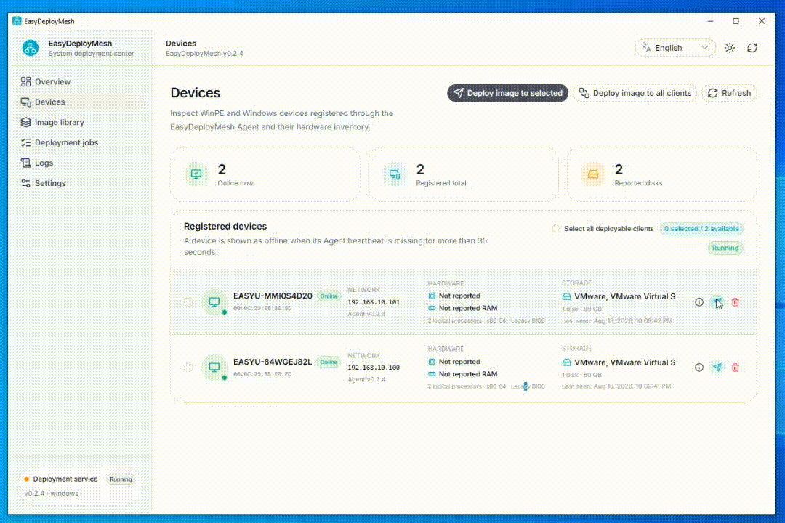
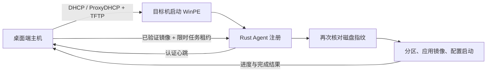

<div align="center">
  

  <h1>EasyDeployMesh</h1>

  <p>
    在局域网内发现计算机，并通过一个桌面应用<br>
    安全、可重复地编排 Windows 镜像部署。
  </p>

  <p>
    <a href="#功能特性">功能特性</a> ·
    <a href="#快速开始">快速开始</a> ·
    <a href="#支持的镜像格式">镜像支持</a> ·
    <a href="#安全模型">安全</a> ·
    <a href="DESIGN.md">设计文档</a> ·
    <a href="CONTRIBUTING.md">参与贡献</a> ·
    <a href="CHANGELOG.md">更新日志</a>
  </p>

  <p>
    <a href="LICENSE"></a>
    <a href="https://github.com/Bald-M/EasyDeployMesh/releases/latest"></a>
    <a href="#项目状态"></a>
  </p>
  <p>
    
    
  </p>
  <p>
    <a href="README.md"><code>English</code></a>
  </p>
</div>

> [!WARNING]
> EasyDeployMesh 会执行具有破坏性的磁盘操作。请先在可随时销毁的计算机或虚拟机上
> 测试部署流程。在 TLS 和证书固定功能完成之前，当前 HTTP 控制通道仅适用于可信、
> 隔离的局域网。

## 功能演示

<p align="center">
  
</p>

## 为什么选择 EasyDeployMesh？

EasyDeployMesh 将设备发现、PXE 启动、镜像验证、部署任务和 WinPE 执行整合到一个
本地优先的工作流中。桌面端主机负责保存权威状态并批准任务；运行在目标机器上的轻量级
Rust Agent 负责实际部署。

项目采用失败关闭原则。镜像必须先复制到受管存储并完成验证；任务通过经过认证且具有
有效期的租约下发；在分区操作开始前，还会再次核对目标磁盘指纹。

## 功能特性

- 使用 Nuxt 4、Nuxt UI 和 Tauri 2 构建的跨平台桌面主机。
- 支持简体中文和英文运行时切换。
- 局域网设备注册、硬件清单、认证心跳和在线状态跟踪。
- 支持独立 DHCP 或 ProxyDHCP 的 PXE 服务、TFTP 和客户端发现。
- 支持导入 ISO、IMG 和现有启动目录，并自动将 Agent 注入 `boot.wim`。
- 持久化 GHO、WIM、ESD 和 SWM 镜像目录，并进行 SHA-256 校验。
- 在 WinPE 中使用 DiskPart、DISM 和 BCDBoot 执行无人值守 WIM/ESD 部署。
- 针对明确限定的 GHO 兼容范围提供原生流式验证和还原，不捆绑或执行 Ghost 软件。
- 具有暂停、重试、取消、进度、活动历史和持久化存储的受控部署状态机。
- 提供机器可读的 WinPE 诊断，并进行令牌脱敏和完整性检查。

## 工作原理



模块布局、协议流程、持久化模型和安全不变量详见 [DESIGN.md](DESIGN.md)。

## 支持的镜像格式

| 格式 | 可编目 | 可部署 | 说明 |
| --- | :---: | :---: | --- |
| WIM | 是 | 是 | 导入时验证，部署前再次验证 |
| ESD | 是 | 是 | 使用 WIM 部署操作和指定的镜像索引 |
| SWM | 是 | 否 | 当前 Agent 仅支持编目 |
| GHO | 是 | 有限支持 | 仅针对下述兼容范围提供手动原生还原 |
| GHS | 是 | 否 | 仅支持分卷发现 |

原生 GHO 支持仅涵盖 Ghost 11.x–12.x 创建的单文件、无密码、分区级 Windows NTFS
镜像，并支持 Z0、Z1 或 Z3–Z9 压缩。整盘镜像、分卷、加密、其他文件系统、镜像创建
和不受支持的压缩模式都会被拒绝，并返回明确原因。

EasyDeployMesh 实现了自己的边界检查流式 Rust 解码器，不会生成 RAW 缓存。导入验证
会同时记录压缩文件 SHA-256 和展开后分区 SHA-256。WinPE 将分区流式写入已锁定并卸载
的目标卷，并在配置启动文件前核对展开后的大小和摘要。

## 快速开始

### 安装发布版本

从 [GitHub Releases](https://github.com/Bald-M/EasyDeployMesh/releases/latest) 下载最新
安装程序。

1. 打开 **Settings**，选择连接到隔离部署局域网的网络接口。
2. 启动控制服务。
3. 导入 WinPE 媒体并启动 PXE，或者在目标机上手动运行 Agent。
4. 确认目标机在 **Devices** 页面显示为在线。
5. 导入受支持的镜像，准确选择目标磁盘，然后创建部署任务。

手动运行 Agent 诊断：

```powershell
easydeploymesh-agent.exe --server http://192.168.1.10:7760 `
  --enrollment-token easydeploymesh_enroll_... --once
```

Enrollment token 是临时令牌。请勿将真实令牌粘贴到 Issue、日志、截图或文档中。

### 从源码运行

环境要求：

- Node.js 22+
- pnpm 11+
- Rust 1.96+
- Tauri 2 平台依赖

```bash
pnpm install
pnpm dev
pnpm tauri:dev
```

`pnpm dev` 会在浏览器中运行 UI，并为原生命令提供安全的开发回退。测试主机集成功能时，
请使用 `pnpm tauri:dev`。

## 开发

运行完整检查：

```bash
pnpm check
```

构建桌面应用：

```bash
pnpm build:mac
pnpm build:windows
pnpm build:linux
```

构建脚本会编译并暂存 Agent、生成 Nuxt 前端、构建原生应用包，并将收集到的安装程序
按架构命名后复制到 `release/`。汇总命令分别生成 macOS Intel 与 Apple Silicon DMG、
Windows ARM64、x86 与 x64 NSIS 安装程序，以及 Linux ARM64 与 x64 AppImage。
macOS 和 Linux 命令应在对应操作系统上运行；非 Windows 主机通过 `cargo-xwin`
交叉构建 Windows 版本。

也可以单独构建某个架构，例如：

```bash
pnpm build:mac:x64
pnpm build:windows:arm64
pnpm build:linux:x64
```

常用的独立检查命令：

```bash
pnpm typecheck
pnpm test
pnpm test:rust
pnpm test:diagnostics
cargo fmt --all --check
```

提交 Pull Request 前请阅读 [CONTRIBUTING.md](CONTRIBUTING.md)。编码代理还应遵循
[AGENTS.md](AGENTS.md)。

## 安全模型

EasyDeployMesh 假定桌面端主机和部署局域网均由操作员控制。目前不适合不可信局域网或
公共网络。

项目采用的纵深防御措施包括：

- 明确绑定指定网络接口。
- 临时 enrollment token 和独立设备凭据。
- 经过认证、与设备及任务绑定且具有有效期的任务租约。
- 具有路径和符号链接范围检查的受管镜像存储。
- 在主机端和 Agent 端重复执行镜像完整性验证。
- 在破坏性操作前重复核对物理磁盘指纹。
- 受控任务状态转换，每台设备最多只能有一个活动任务。
- 有界 GHO 解析和展开输出限制。
- 不回显 enrollment token 的脱敏诊断工具。

请勿在公开 Issue 中披露漏洞利用细节或敏感部署数据。请按照
[CONTRIBUTING.md](CONTRIBUTING.md) 中的私密报告说明操作。

## WinPE 现场验收

<details>
<summary><strong>Windows / EasyU WinPE 现场验收步骤</strong></summary>

控制服务启动时，EasyDeployMesh 会使用 Agent 和完整 WinPE runtime 的 SHA-256 标记
检查并刷新已经导入的 `boot.wim`。从旧版本升级后，建议重新导入一次 EasyU PE 媒体，
以排除旧包、旧启动链或不完整导入留下的不确定状态。

1. 在 **Settings** 中保持控制服务运行，**只停止 PXE 服务**，然后从 PXE 页面重新导入
   EasyU PE 媒体。
2. 保持 PXE 停止，在管理员 PowerShell 中从仓库根目录运行包验证程序：

   ```powershell
   .\scripts\verify-winpe-package.ps1 -PackageRoot "$env:APPDATA\com.easydeploymesh.desktop\pxe-boot"
   ```

3. 重新启动 PXE，让目标机通过 PXE 进入 EasyU WinPE，然后运行：

   ```bat
   X:\EasyDeployMesh\collect-winpe-runtime.cmd
   ```

   `X:` 是重启后会丢失的 WinPE RAM 盘。请在重启前复制完整诊断目录，或将可写的
   持久卷作为第一个参数：

   ```bat
   X:\EasyDeployMesh\collect-winpe-runtime.cmd "E:\EasyDeployMesh-diagnostics"
   ```

4. 将诊断目录复制回开发机并运行只读分析器：

   ```bash
   node scripts/analyze-winpe-runtime.mjs /path/to/EasyDeployMesh-diagnostics
   node scripts/analyze-winpe-runtime.mjs --json /path/to/EasyDeployMesh-diagnostics
   ```

分析器退出码：

| 代码 | 含义 |
| :---: | --- |
| `0` | 完整报告和 Agent 日志证明部署已经完成 |
| `1` | 检测到明确阻塞 |
| `2` | Agent 已注册，但任务未完成或证据不足 |
| `64` | 命令行参数无效 |
| `65` | 报告被截断、结构无效或 Agent 日志状态不一致 |
| `74` | 缺少必要输入 |

现场验收成功时，包验证程序的所有项目都应为 `[PASS]`，摘要应显示 `0 failed`，进程
退出码应为 `0`。`winpe-runtime.txt` 应显示 Agent 版本和进程、正确的控制服务地址、
已脱敏的 enrollment token 状态、可用的网络适配器和路由，以及预期磁盘和固件模式。
桌面端 **Devices** 页面应自动将目标机显示为已注册且在线。

分析器只读取固定报告和脱敏后的 Agent 日志。它不会执行诊断目录中的脚本或程序，也不
会回显原始日志、路径或令牌。

</details>

## 项目状态

EasyDeployMesh 仍在积极开发中。在实验室以外使用前，请先查看当前限制，并为所有重要
数据保留可恢复的备份。发布历史请参阅 [CHANGELOG.md](CHANGELOG.md)。

## 许可证

本项目使用 [Apache License 2.0](LICENSE) 许可证。
